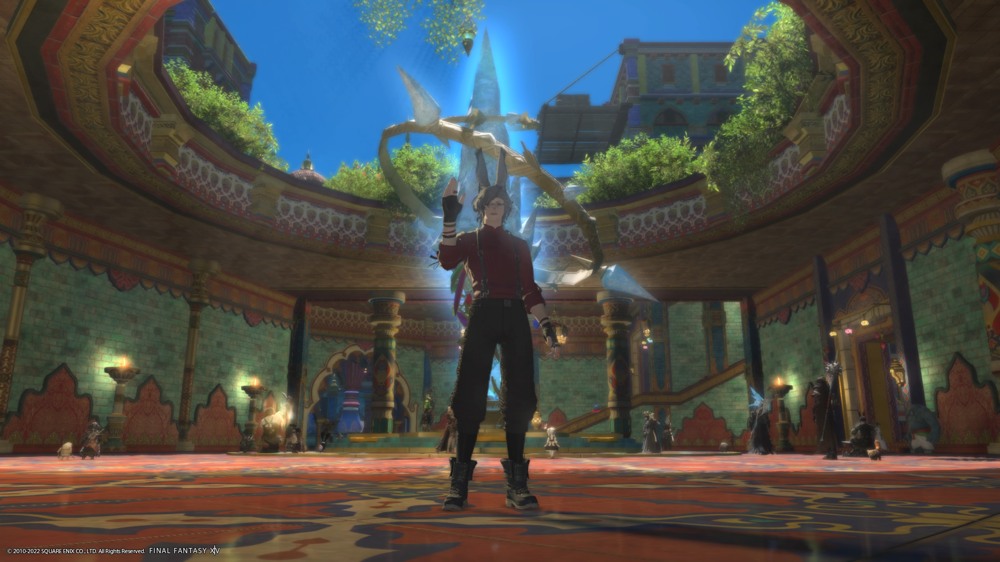
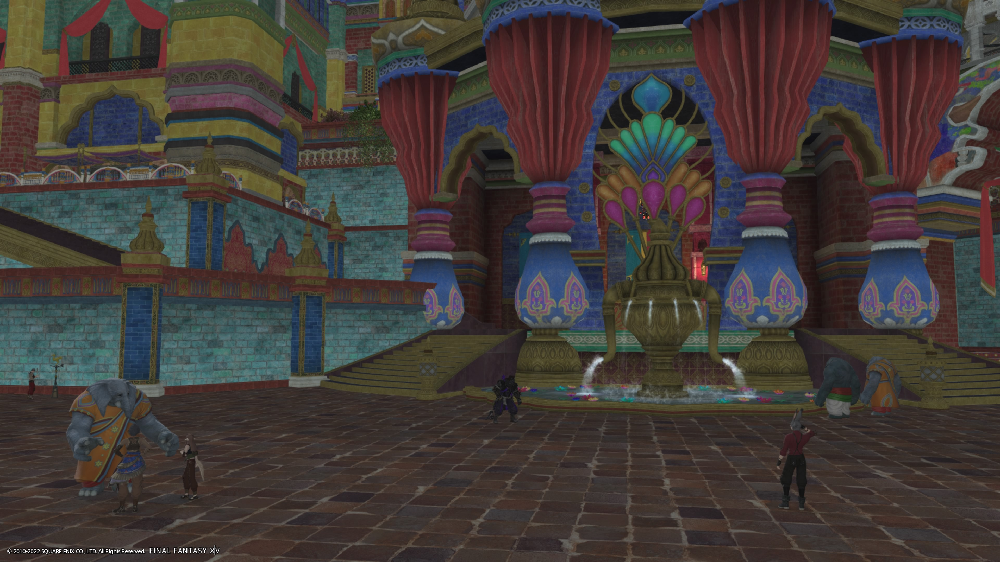
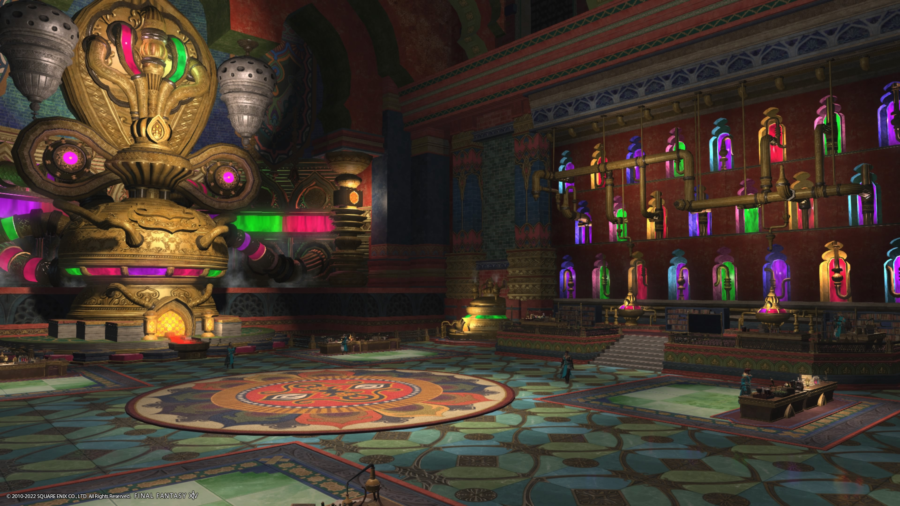
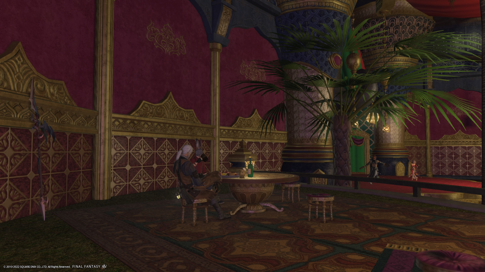

# Radz-at-Han

Capital of the country of Thavnair, it is a place the story tells us about years before it was a place you could visit ourselves.  The culture here draws heavily on real-world India.  It is currently one of the main hub cities for adventurers.

At the entrance of the city is Alzadaal's Peace.  It is named after a tribe leader who lead his people to Thavnair.

> Within this mausoleum is interred the mortal remains of Alzadaal, leader of the Auri tribe which sailed to Thavnair from the mainland. By joining the might of his people with the Arkasodara, Alzadaal tipped the scales against the Gajasura, bringing an end to the internecine war of the Matanga tribes.

Further inside the city is one of my favorite areas in the city called the High Crucible of Al-Kimiya.  Thavnair is perhaps most famous for being the birthplace of alchemy, which is something like magical chemistry.  There are many rare gear components that are only created here.  The picture really doesn't do it justice.

For the final entry in this log we come to Mehryde's Meyhane.  Wikipedia defines a meyhane: From Persian میخانه‎ (meyxâne), compound of می‎ (may, “wine”) and خانه‎ (xâne, “house”).   Its a cozy restaurant with a stage.  I had the opportunity to share lots of good meals with my colleges, and the dance troupes put on great performances here. One friend, Estinien, decided to stay here once we had finished our last grand adventure.  He claims he doesnt like it, but he doesnt complain about the food...

